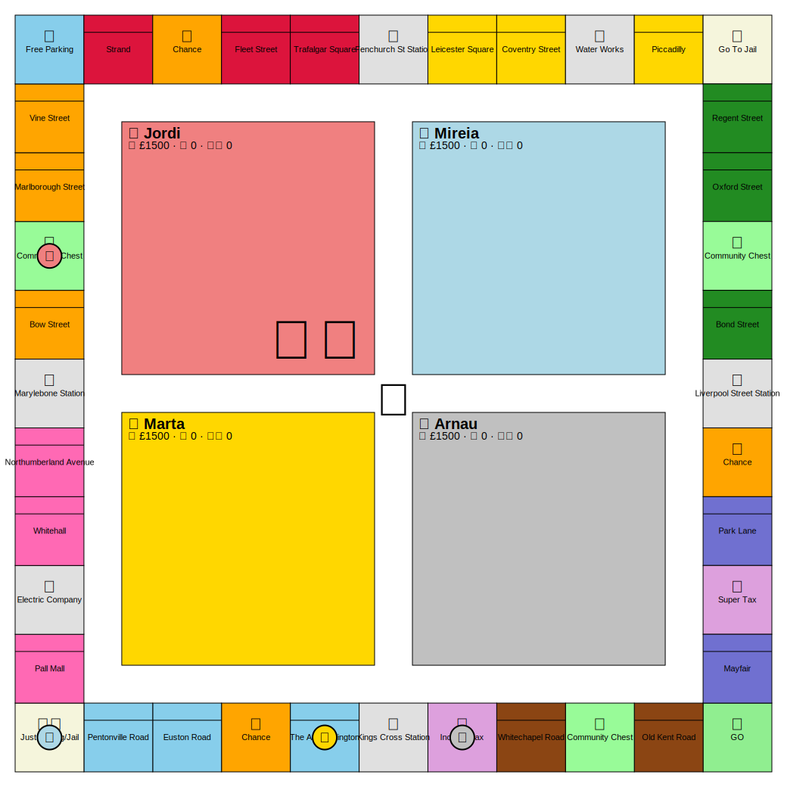
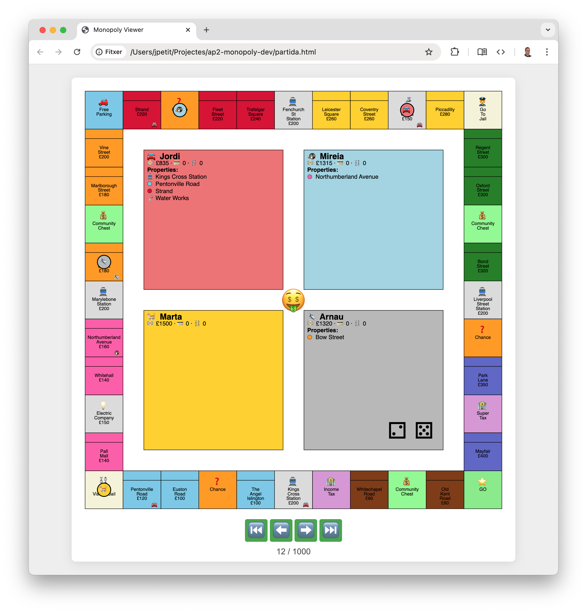
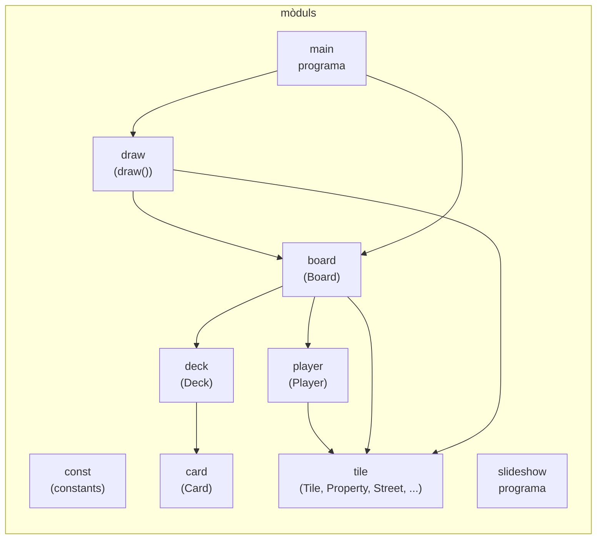

# Primera Pràctica d'AP2: Monopoly

En aquesta pràctica desenvoluparàs un joc del Monopoly!

Hauràs d'implementar la lògica del joc i permetre que jugadors automàtics hi disputin partides. Les partides es podran visualitzar en un navegador.

## El joc del Monopoly

El Monopoly és un joc de taula clàssic en què els jugadors competeixen per acumular propietats i capital mentre intenten portar els seus rivals a la fallida.

Cada casa sol jugar amb unes regles lleugerament adaptades... En aquesta pràctica seguirem les regles oficials del joc (https://instructions.hasbro.com/api/download/C1009_en-nz_monopoly-classic-game.pdf), amb les excepcions següents per simplificar la implementació:

- **Jugadors**: El joc es juga amb 2, 3 o 4 jugadors. El primer jugador sempre comença.

- **Cases i hotels**: No hi ha límit en el nombre total de cases i hotels disponibles.

- **Propietats no comprades**: Si un jugador no pot o no vol comprar una propietat, aquesta simplement no es compra (no hi ha subhasta).

- **Interaccions entre jugadors**: Els jugadors no poden negociar, fer tractes ni intercanviar elements entre ells.

- **Ordre de les accions**: Les accions de gestió (comprar o vendre cases/hotels, hipotecar/deshipotecar propietats, vendre propietats al banc, cobrar el salari de passar per sortida) es fan **després** que el jugador mogui i compleixi amb les accions de la casella on cau. En conseqüència, un jugador pot anar a la fallida encara que tingui propietats, si no té suficient liquiditat en el moment necessari.

- **Gestió de propietats**: Les operacions de compra-venda de cases/hotels, hipoteques i venda de propietats al banc es fan **d'una en una**. Cada operació ha de ser legal per si mateixa.

- **Presó**: Un jugador surt de la presó si:
  - Obté una tirada doble
  - Té una carta de _Sortir de la presó lliure_ (que es retorna a la baralla després de l'ús)
  - Completa 3 torns a la presó

  **No** és possible pagar M50 per sortir de la presó voluntàriament, ni s'ha de pagar M50 després del tercer torn.

## Disseny del joc

S'ofereix un esquelet del joc amb algunes funcionalitats ja implementades. Utilitza'l com a punt de partida, però adapta'l segons les teves necessitats.

També es proporcionen fitxers JSON amb les dades de propietats, targetes i jugadors del joc de Londres. **Aquests fitxers no es poden modificar**. Teniu informació sobre els fitxers JSON a https://lliçons.jutge.org/python/fitxers/index.html#format-json.

### Mòdul `const`: Constants

Emmagatzema les constants del joc: salari de la casella de sortida, diners inicials per jugador, etc.

### Mòdul `tile`: Classe `Tile` i subclasses

La classe `Tile` representa una casella del tauler i serveix com a classe base per a tipus més específics:

- `Property`: Propietats que es poden comprar
  - `Street`: Carrers
  - `Station`: Estacions
  - `Utility`: Serveis públics
  - ...

**Mètode clau**: `land_on(self, player: Player)` gestiona les accions quan un jugador cau a la casella. Aprofita el polimorfisme per implementar-lo a les subclasses.

**Funció auxiliar**: `build_tile(board: Board, data: dict[str, Any]) -> Tile` crea caselles del tipus adequat a partir de les dades JSON.

### Mòdul `card`: Classe `Card` i subclasses

La classe `Card` representa targetes de Sort i Comunitat. És una classe base que s'especialitza en diferents tipus de targetes segons la seva funció.

**Funció auxiliar**: `build_card(data: dict[str, Any]) -> Card` crea targetes del tipus adequat a partir de les dades JSON.

### Mòdul `deck`: Classe `Deck`

Representa una pila de targetes (Sort o Comunitat) amb la funcionalitat per barrejar-les i robar-ne.

### Mòdul `player`: Classe `Player`

Representa un jugador al joc, incloent:

- Informació bàsica: nom, color, fitxa
- Estat del joc: posició al tauler, propietats, capital, etc.

Ja s'han implementat alguns mètodes que **has de mantenir**, ja que el visor gràfic els utilitza.

**Funció auxiliar**: `build_player(board: Board, data: dict[str, Any], index: int) -> Player` crea jugadors a partir de les dades JSON i els col·loca al tauler.

### Mòdul `board`: Classe `Board`

Representa el tauler de joc complet, incloent:

- Totes les caselles
- Piles de targetes Sort i Comunitat
- Jugadors

Gestiona totes les jugades assegurant que compleixen les regles. Alguns mètodes ja implementats **s'han de mantenir** per compatibilitat amb el visor gràfic.

**Funcions auxiliars**:

- `save_board`: Desa taulers en format Pickle
- `load_board`: Carrega taulers des de format Pickle

### Mòdul `draw` i programa `slideshow`

**`draw(board: Board, svg_path: str)`**: Desa la visualització del tauler en un fitxer SVG que pots veure amb un navegador.

Exemple de tauler visualitzat:

**`slideshow.py`**: Crea una pàgina web HTML que mostra una seqüència de taulers SVG, permetent visualitzar una partida completa.

Ús: `python3 slideshow.py partida.html tauler-*.svg`

Pots visualitzar el resultat (`partida.html`) al navegador:

No s'espera que hagis de modificar aquests fitxers.

### Mòdul `main`

El programa principal crea el tauler de joc a partir dels fitxers JSON i hauria de jugar el joc, desant el tauler de joc en format SVG en cada torn.

### Diagrama de mòduls i classes

(Tots usen `const`, no s'han posat al diagrama per simplificar-lo)

## Dependències

Aquest projecte només depèn de `drawsvg`, una llibreria de Python per dibuixar gràfics vectorials en format SVG.

**Instal·lació**: `python3 -m pip install drawsvg` (o utilitza `uv`)

El fitxer `drawsvg.pyi` proporciona els tipus necessaris per a `drawsvg`.

**Important**: No pots utilitzar altres llibreries no estàndard.

## Proposta de passos per implementar el Monopoly

A continuació es presenta una proposta de passos per implementar el Monopoly. Aquesta és una proposta i no és obligatòria. Pots adaptar-la segons les teves necessitats i preferències.

### Pas 0: Preparació i familiarització

- Pas 0.1: Explorar l'estructura del projecte, fitxers JSON i codi esquelet proporcionat
- Pas 0.2: Configurar l'entorn i instal·lar dependències (`drawsvg`)

### Pas 1: Estructura bàsica del tauler

- Pas 1.1: Implementar la classe `Tile` base amb `land_on` i `build_tile` bàsic
- Pas 1.4: Crear el tauler complet carregant totes les caselles des del JSON i fer-les "neutres" (caselles on no passa res)

### Pas 2: Jugadors bàsics

- Pas 2.1: Implementar la classe `Player` amb tots els atributs necessaris
- Pas 2.2: Implementar moviment bàsic pel tauler i pas per la casella de sortida
- Pas 2.3: Integrar jugadors al tauler carregant-los des del JSON

### Pas 3: Sistema de daus i torns

- Pas 3.1: Implementar el llançament de daus i detecció de tirades dobles
- Pas 3.2: Implementar la lògica de torn bàsica (tirar, moure, executar casella, següent jugador)
- Pas 3.3: Gestionar tirades dobles (torns extra i tercera doble → presó)

### Pas 4: Propietats - compra i possessió

- Pas 4.1: Implementar la classe `Property` amb compra i verificació de disponibilitat
- Pas 4.2: Implementar `Street` amb cases/hotels i càlcul de lloguer
- Pas 4.3: Implementar `Station` amb càlcul de lloguer segons nombre d'estacions
- Pas 4.4: Implementar `Utility` amb càlcul de lloguer segons daus i quantitat
- Pas 4.5: Integrar `land_on` per propietats (compra si lliure, lloguer si ocupada)

### Pas 5: Estratègia del jugador automàtic

- Pas 5.1: Definir la interfície d'estratègia per decisions del jugador
- Pas 5.2: Implementar una estratègia simple (comprar sempre, no construir)
- Pas 5.3: (Opcional) Implementar estratègia millorada amb gestió intel·ligent

### Pas 6: Cases i hotels

- Pas 6.1: Implementar compra de cases amb verificació de monopoli i construcció uniforme
- Pas 6.2: Implementar compra d'hotels (conversió de 4 cases)
- Pas 6.3: Implementar venda de cases/hotels mantenint construcció uniforme

### Pas 7: Hipoteques i hipotecar

- Pas 7.1: Implementar hipotecar propietats (sense cases, cobrar meitat del preu)
- Pas 7.2: Implementar deshipotecar propietats (pagar preu + 10% interessos)
- Pas 7.3: Gestionar que les propietats hipotecades no cobren lloguer

### Pas 8: Targetes (sort i comunitat)

- Pas 8.1: Implementar la classe `Card` base amb mètode `execute`
- Pas 8.2: Implementar la classe `Deck` amb barreja i roba de targetes
- Pas 8.3: Implementar tots els tipus de targetes (diners, moviment, presó, etc.)
- Pas 8.4: Implementar caselles de targetes (`ChanceSquare`, `CommunityChestSquare`)

### Pas 9: Sistema de presó

- Pas 9.1: Implementar enviament a la presó (moure, marcar estat, reiniciar comptador)
- Pas 9.2: Implementar sortida de la presó (dobles, targeta, o 3 torns)

### Pas 10: Gestió post-moviment

- Pas 10.1: Implementar accions post-moviment (comprar cases, hipotecar, vendre) d'una en una
- Pas 10.2: Integrar les decisions de l'estratègia amb les accions post-moviment

## Consells generals

Per a cada pas:

1. Implementar la funcionalitat mínima
2. Escriure proves per verificar-la
3. Documentar el que s'ha fet
4. Opcional: Fer commit al control de versions
5. Només llavors passar al següent pas

Gestió de problemes:

- Si un pas és massa gran, dividir-lo en sub-passos
- Si et bloqueges, torna al pas anterior i revisa
- Mantén sempre el codi sense erors de tipus i funcional
- Fes proves incrementals constantment

Bones pràctiques:

- Opcional: Commits freqüents amb missatges descriptius
- Tests abans de passar al següent pas
- Documentació concurrent amb la implementació
- Refactorització periòdica del codi

## Estratègies de jugadors

El propòsit d'aquesta pràctica no és que facis un jugador automàtic marevellós, sinó que implementis una estratègia de jugador automàtic que permeti validar que el tauler de joc funciona correctament.

Per tant, una estratègia senzilla és suficient. Per exemple, pots implementar una estratègia que compri totes les propietats lliures que trobi si té prou diners, que vengui la propietat més cara possible si els diners que té es troben per sota d'una certa quantitat i que no edifiqui mai.

Ara bé, malgrat que la estratègia sigui senzilla, el joc ha de garantir que es puguin aplicar totes les accions del joc seguint les regles.

## Avaluació

L'avaluació de la teva pràctica tindrà en compte diversos aspectes clau, entre els quals es destaquen els següents:

1. **Qualitat del codi**: S'examinarà el codi font tenint en compte diversos factors, com ara la _correctesa_, la _completitud_, la _llegibilitat_, l'_eficiència_, el _bon ús dels identificadors_, ètc. També es tindrà en compte la _bona estructuració_ del codi, és a dir, l'ús adequat de funcions, classes, mòduls i altres elements que afavoreixin la redacció, la comprensió i el manteniment del codi a llarg termini. En aquesta pràctica es valorarà especialment l'ús de l'herència i la polimorfisme per simplificar la implementació. Es valorarà negativament l'ús de funcions llargues o poc clares, funcions incomprensibles sense especificació, la presència de codi duplicat o innecessari, acoblament fort, variables globals o atributs de classe erronis, comentaris excessius, i altres pràctiques nocives. Totes les funcions han de tenir anotacions de tipus i, idealment, `mypy` no hauria de donar cap diagnòstic.

2. **Qualitat de la documentació**: S'analitzarà la documentació del projecte, amb especial atenció a la seva _claredat_, _precisió_ i _completesa_, alhora que la seva _concisió_. La documentació hauria de descriure adequadament el funcionament del codi, les seves funcions i característiques principals, així com qualsevol altre aspecte rellevant que faciliti la comprensió i l'ús del projecte. La documentació també ha de deixar clares les decisions de disseny preses. Cal separar l'especificació de les classes, funcions i mètodes (què fan) dels comentaris sobre el codi (com es fa). El `readme` ha d'estar en format Markdown i ha d'aportar tots els elements necessaris.

3. **Qualitat dels jocs de proves**: Es valorarà l'_existència_, la _cobertura_ i la _fiabilitat_ dels jocs de proves dissenyats per verificar el correcte funcionament del codi. Els jocs de proves han de ser suficientment amplis i variats per garantir que el codi respon de manera adequada a diferents situacions i casos d'ús. Tanmateix, els jocs de proves han de ser _limitats_, _concisos_ i _eficaços_, evitant la redundància i la repetició innecessària. Alhora, el propòsit dels jocs de proves ha de ser _fàcil de comprendre_. Han de ser fàcils d'_executar_, i han de proporcionar una _sortida clara_ que permeti identificar ràpidament qualsevol problema o error.

En definitiva, és important recordar que es tracta d'un projecte de programació i, per tant, s'espera que el codi segueixi totes les _bones pràctiques de programació_ que s'han ensenyat a AP1 i AP2.

# Desenvolupament de la pràctica

Aquesta pràctica té dues parts:

1.  A la primera part has d'implementar els mòduls descrits.

    Has de lliurar la pràctica a través de l'aplicació **Mussol**. Per a fer-ho, vés a https://mussol.jutge.org, identifica't amb el teu usuari oficial de la UPC (acabat amb `@estudiantat.upc.edu`) i la teva contrasenya de Jutge.org i tria l'activitat "AP2 2026 Monopoly". Has de lliurar un fitzer `zip` amb els continguts que es descriuen més tard.

    Compte: Has de tenir cura de **NO** identificar els continguts lliurats amb el teu nom o altre informació personal teva: el teu lliurament ha de ser completament anònim. Això també s'aplica als noms dels fitxers.

    La data límit per lliurar la primera part de la teva pràctica és el divendres 20 de març fins a les 15:00.

2.  A la segona part de la pràctica has de corregir tres pràctiques d'altres companys. Aquesta correcció es farà també a través de **Mussol** i implicarà valorar diferents rúbriques que només veuràs en aquest punt.

    L'avaluació també serà anònima. El sistema calcularà automàticament la teva nota i també avisarà als professors de possibles incoherències. Els abusos seran penalitzats.

    Cada estudiant té el dret de rebutjar la nota calculada a partir de la informació rebuda dels seus companys i pot demanar l'avaluació per part d'un professor (qui podrà puntuar a l'alta o a la baixa respecte l'avaluació dels estudiants). Els professors també poden corregir pràctiques "d'ofici" i substituir la nota calculada per la del professor.

    Pots començar a corregir les pràctiques dels teus companys a partir del dilluns 27 de març a les 15:00. La data límit per lliurar la segona part de la teva pràctica és el dilluns 20 d'abril a les 15:00. No podràs veure les correccions dels teus companys fins al dimecres 22 d'abril a les 15:00.

Totes les pràctiques s'han de fer individualment. Els professors utilitzaran programes detectors de plagi. És obligatori corregir les pràctiques dels tres companys assignades pel **Mussol**. Els terminis de lliurament són improrrogables.

## Lliurament

Lliura la teva pràctica al Mussol en un fitzer `.zip` que contigui:

- Tots els fitxers `.py` necessaris.

- Un fitxer `README.md` escrit en Markdown que contingui la informació de la teva pràctica. Consulta https://www.markdownguide.org/cheat-sheet/ i https://www.makeareadme.com/ per exemple.

- Si cal, imatges a `images/*.png` per complementar el `README.md`.

El fitxer `.zip` no ha de contenir res més. Ni repositoris git, ni directoris `__pycache__`, etc.

# Consells

- Comprova que cada part que fas funciona correctament, documenta el teu codi amb els comentaris necessaris i sense comentaris innecessaris i especifica totes les classes i mètodes amb _docstrings_.

- Assegura't que el teu programa inclou els tipus de tots els paràmetres i resultats a totes les funcions i que no hi ha errors de tipus amb `mypy`.

- Per evitar problemes de còpies, no pengis el teu projecte en repositoris públics.

- No esperis al darrer moment per fer el lliurement.

  De debò.

  No, no és bona idea: El cafè que t'has preparat per mantenir-te despert es vessarà damunt del teclat, la corrent marxarà al darrer moment, l'internet deixarà de funcionar cinc minuts abans del _deadline_, l'ordinador on tenies el projecte (del qual mai has còpies de seguretat) et caurà a terra i es trencarà en mil bocins... Tot això ha passat. El **Mussol** no et deixarà fer lliuraments passats els terminis. Pots fer múltiples lliuraments, el definitiu sempre és el darrer.

# Autors

Jordi Petit

©️ Universitat Politècnica de Catalunya, 2026
