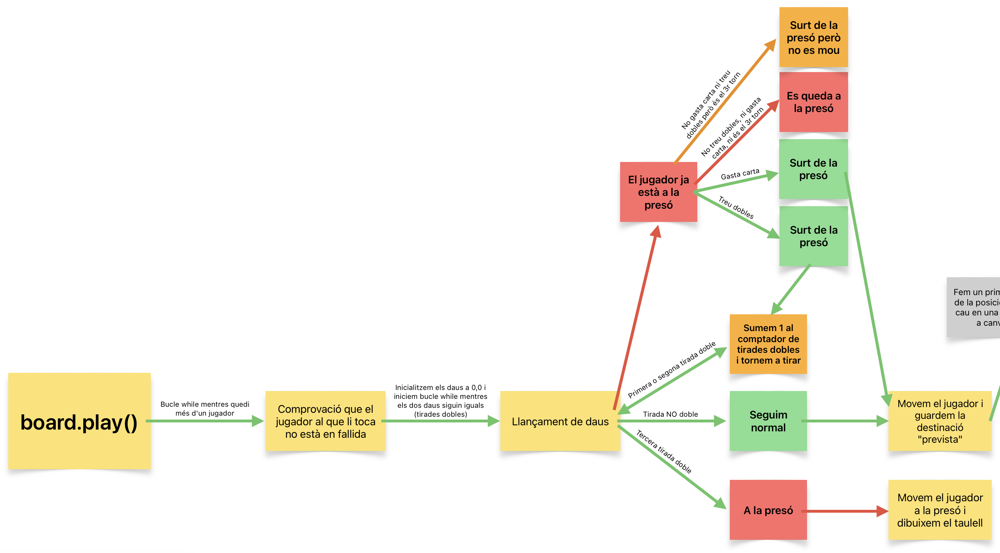
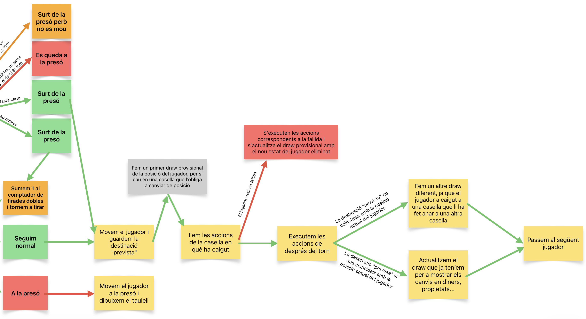

# Primera Pràctica d'AP2: Monopoly

## Introducció
Aquest projecte consisteix en l'automatització del joc de taula Monopoly, implementant tota la lògica del joc, gestió de propietats, targetes de sort i comunitat, i una interfície basada en fitxers svg i manipulable a través d'un fitxer html. Per a explicar el funcionamet del projecte i com està implementat, partirem de la base que ja tothom sap les normes del Monopoly i com jugar-hi.

## Arquitectura
El projecte està estructurat en diferents mòduls independents, però tots ells interconnectats per a facilitar el manteniment del codi i l'escalabilitat. Tot seguit mencionaré tots aquells mòduls que no estaven ja implementats al codi proporcionat.

### Mòdul main
El mòdul main és el programa principal que crea la carpeta en què s'emmagatzemen els fitxers .svg creats durant l'execució del programa i crea el tauler de joc a partir dels fitxers JSON proporcionats. A més a més, s'encarrega de començar el joc.

### Mòdul board
El mòdul board s'encarrega de gestionar el flux del joc, els torns i el tauler. En primer lloc, s'encarrega de construir tots els jugadors, cartes, i caselles del joc. En segon lloc, conté tota una sèrie de mètodes per a poder consultar tot tipus d'informació relacionada amb la partida, com el nombre de jugadors, l'index d'una casella, quin és el jugador actual... Finalment, s'encarrega de fer que, mentres quedi més d'un jugador "viu", es jugui automàticament. A continuació s'adjunta un diagrama amb la lògica que segueix el mètode play. 

### Mòdul player
El mòdul player s'encarrega de tot allò relacionat amb les accions dels jugadors, la seva representació al taulell, les seves propietats i estat financer... Inclou mètodes per a poder accedir i modificar informació com els seus diners, les seves propietats, quants torns porten a la presó, moure el jugador un número de caselles o moure'l a una casella determinada, i molt més.

### Mòdul tile
El mòdul tile s'encarrega de totes aquelles accions directament relacionades amb una de les caselles del taulell. Inclou mètodes per a poder accedir al lloguer d'una propietat, la quantitat de cases que té construïdes, consultar el que es guanya hipotencant-la... De la mateixa manera, gestiona què és el que succeeix quan un jugador cau a cadascun dels tipus de caselles, per mitjà del mètode land_on(). Aquest mòdul està basat en una jerarquia molt senzilla amb la classe Tile i les subclasses Property (i subclasses Street, Station i Utility), Tax i Card.

### Mòdul card
El mòdul card s'encarrega de totes les accions relaciones amb un carta de la sort o de la comunitat. Té una classe CArd i 11 subclasses, una per a cada una de les possibles accions que poden sortir a un carta (anar a una casella, anar a la presó, pagar X diners, rebre Y diners...)

### Mòdul strategy
El mòdul strategy s'encarrega de les decisions estratègiques que pren cada jugador. Depenent del tipus d'estratègia que els hi ha estat assignada, cada jugador prendrà unes decisions o unes altres, i decidirà si compra o no una casa o propietat, si hipoteca una propietat...

## Decisions de disseny
- **Mètode land_on**: en comptes d'implementar un llarguíssim mètode land_on ple d'ifs per a tots els tipus de caselles, vaig decidir fer ús del polimorfisme i implementar un mètode land_on a cada subclasse de la classe Tile.

- **Sistema de fallida**: el sistema de fallida ha esta una mica peculiar en aquest projecte, ja que estem limitats per unes normes més senzilles de les normals per tal de fer el projecte més senzill. Normalment, quan un jugador cau a una casella, pot realitzar totes les accions que vulgui, com hipotecar, vendre cases, negociar, etc., però en el nostre cas primer s'ha de complir amb les obligacions de la casella i després realitzar les accions post-torn. Per aquest motiu, en el monopoly, quan un jugador entra en fallida, primer intenta pagar el seu deute venent tot el que pot, i després, si continua sense poder pagar, li dona tot el seu patrimoni al jugador que li ha provocat la fallida. En el cas d'aquest projecte això no és possible, així que vaig decidir que les propietats es traspassessin al jugador que provoca la fallida tal i com les tenia l'altre jugador. En canvi, si a qui li deu diners és al banc, totes les cases es treuen per a que altres jugadors puguin tornar a comprar les propietats sense les cases.

- **Estratègia**: l'estratègia implementada és realment senzilla. Hi ha dues estratègies: Simple i Advanced, assignada a l'inici del joc la Simple als jugadors amb índex senar i la Advanced als jugadors amb índex parell. Els jugadors Advanced sempre mantenen unes reserves de diners (i per tant no compren si tot i tenir prou diners no són suficients per a mantenir-se per sobre de les reserves), i quan els seus diners baixen d'una certa quantitat, venen cases i propietats. En canvi, els jugadors Simple sempre que poden compren totes les propietats, no construeixen res, ni venen res.

- **Mètode execute**: de manera similar al mètode land_on de les caselles, el mètode execute s'encarrega d'executar les accions correspondents a cada carta. D'igual manera, he fet servir el polimorfisme per a tenir un codi més net i intel·ligible

- **Post-turn actions**: un cop complides les obligacions de la casella en què cau, s'itera sobre totes les propietats del jugador per a veure quines accions de post-torn hi pot realitzar. Per a no complicar més la cosa, la llista amb totes les propietats no està ordenada de cap manera específica, simplement està ordenada segons l'ordre d'addició a la llista.

## Instruccions
- **Pas 1**: Executa el programa main.py i introdueix el nombre de jugadors (1-4) que dessitges a la partida. Veuràs que es crea una carpeta anomenada output en què es guarden totes les imatges dels taulells. 
- **Pas 2**: Posa aquesta comanda (o alguna cosa similar al teu ordenador) a la terminal per a crear el fitxer partida.html: **python3 src/slideshow.py partida.html output/tauler-*.svg**
- **Pas 3**. Obre el fitxer partida.html des de l'explorador d'arxius al teu navegador